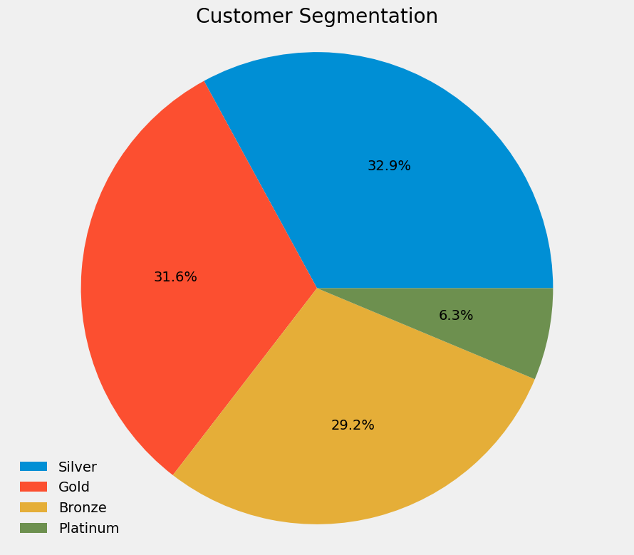
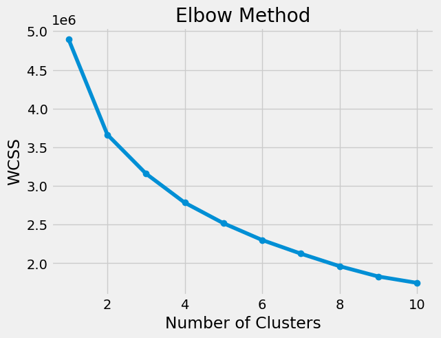

# Bank-Customer-Segmentation

## Project Overview

This project involves segmenting bank customers based on their transaction data using RFM (Recency, Frequency, Monetary) analysis and K-means clustering. The goal is to identify distinct customer segments to tailor marketing strategies and improve customer retention.

### About Dataset

This dataset contains over a million entries, detailing customer demographics, account balances, and transaction information, with variables including customer ID, date of birth, gender, location, and transaction specifics such as date, time, and amount.

### RFM Analysis

RFM (Recency, Frequency, Monetary) analysis is a method used to quantify customer value. It is based on three dimensions:

- **Recency (R):** How recently a customer made a purchase.
- **Frequency (F):** How often a customer makes a purchase.
- **Monetary (M):** How much money a customer spends.
By scoring customers on these three dimensions, businesses can identify their most valuable customers and develop targeted marketing strategies.

Formula used for RFM Calculation

	0.15 * Recency Score + 0.28 * Frequency Score + 0.57 * Monetary Score

| RFM Score Range | Segment  |
|-----------------|-----------|
| RFM > 4         | Platinum  |
| 4 > RFM >= 3    | Gold      |
| 3 > RFM >= 2    | Silver    |
| RFM < 2         | Bronze    |



### K-Means Clustering

K-means is a popular clustering algorithm used to partition data into distinct groups (clusters). The algorithm aims to minimize the within-cluster variance by iteratively assigning data points to the nearest cluster centroid and then recalculating the centroids based on the current assignments.

In this project, we applied K-means clustering to the RFM scores to identify distinct customer segments.



### Conclusion

This project demonstrates the application of RFM analysis and K-means clustering for customer segmentation in the banking sector. By understanding the behavior and value of different customer segments, banks can develop more effective marketing strategies and enhance customer loyalty.

### Environment


```BASH
pyenv local 3.11.3
python -m venv .venv
source .venv/bin/activate
pip install --upgrade pip
```